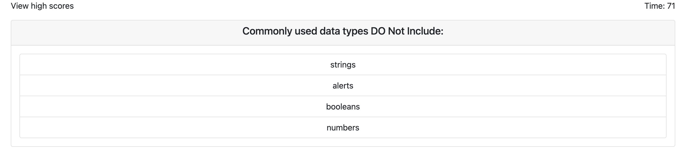
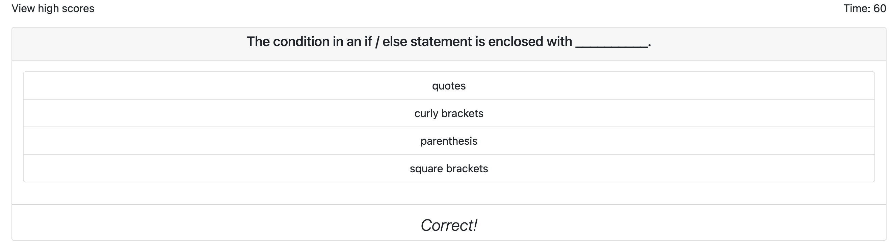
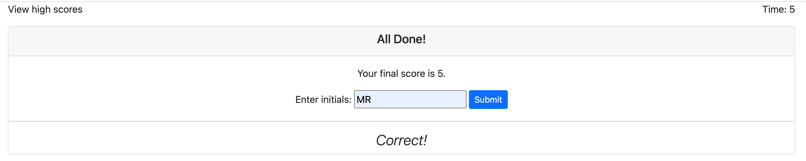
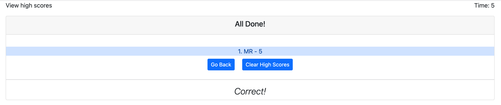

# Code Quiz v2.0 :test_tube::part_alternation_mark:

#### This is an online quiz app that runs completely in the browser. Final score equals total time remaining. For every wrong answer, 15 seconds/points will be subtracted from final score. Users are able to store their high scores in localStorage as well as clear the cache. 

### To use this Application

- [Go to live link](https://mrahma04.github.io/code-quiz-v2.0/)
- [See Walkthrough Video](https://drive.google.com/file/d/1kPDPqeFTlla8fftI-JZa2604nuo5npUw/view)
- Click 'Start Quiz' to begin
- Enter initials to save score in localStorage
- Click 'View high scores' to see previous high scores in sorted, ASCENDING order

### User Story

```
AS A coding boot camp student
I WANT to take a timed quiz on JavaScript fundamentals that stores high scores
SO THAT I can gauge my progress compared to my peers
```

### Acceptance Criteria

```
GIVEN I am taking a code quiz
WHEN I click the start button
THEN a timer starts and I am presented with a question
WHEN I answer a question
THEN I am presented with another question
WHEN I answer a question incorrectly
THEN time is subtracted from the clock
WHEN all questions are answered or the timer reaches 0
THEN the game is over
WHEN the game is over
THEN I can save my initials and score
```
### Screenshots





